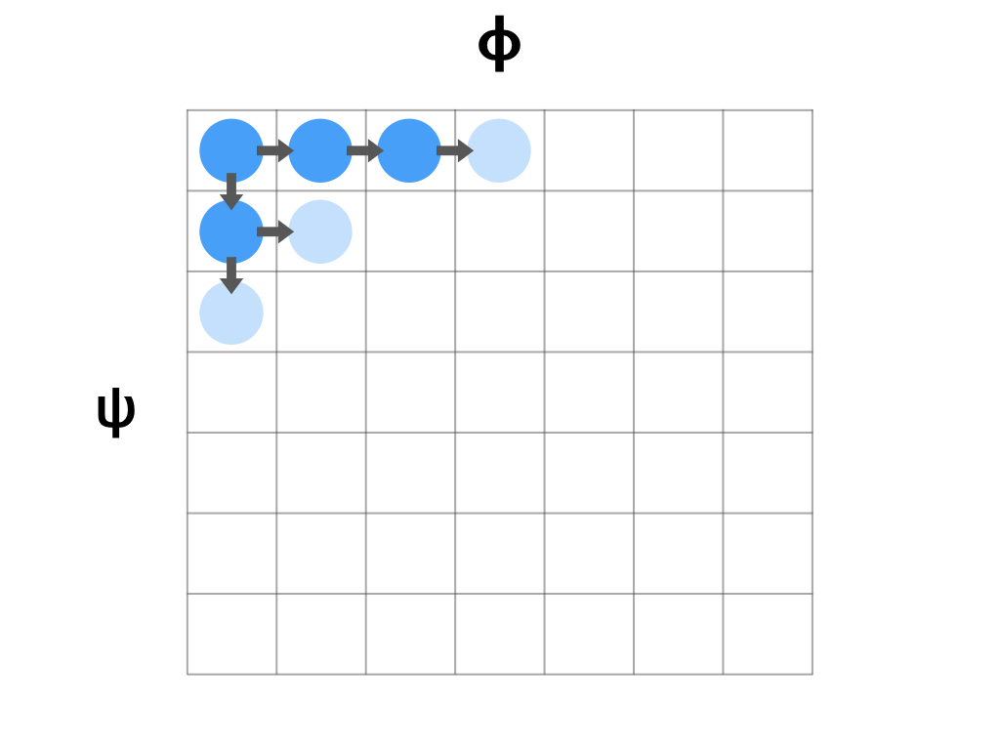
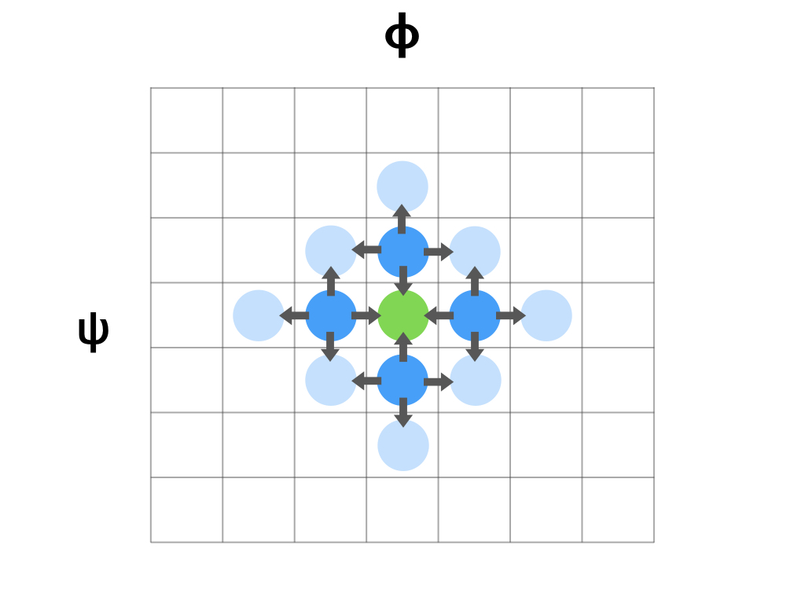

.. torsiondrive documentation master file, created by
   sphinx-quickstart on Thu Mar 15 13:55:56 2018.
   You can adapt this file completely to your liking, but it should at least
   contain the root `toctree` directive.

=========================================================
TorsionDrive
=========================================================

*TorsionDrive is a software package for scanning the potential energy surface of molecules along the torsional degrees of freedom.*

Method
------
A N-dimensional torsion scan can be visualized as filling a N-dimensional grid of dihedral angles.
 - Each grid point represents a unique combination of dihedral angles, (ψ,φ)
 - The value of each grid point is the energy of the structure that has the (ψ,φ) torsion angles

For example, to perform a 2-D torsion scan, one may proceed with a "regular scan" -- scan a leading dimension then go through each value of the second dimension.

The arrows in the diagram represent "constrained optimizations", starting from one structure matches the torsion angels of the grid, ending at a new structure with torsion angles equal to a neighboring grid.

In comparison, a "torsiondrive" scan fills the dihedral grid by "wavefront propagation".
 - Starting with one or more "seed" geometries, each optimize to their closest grid point.
 - All initial grid points are set as "active".
 - All "active" grid points create constrained optimizations towards each of its neighboring grid points.
 - The neighboring grid points gets their first energy, and they're set to "active", starting new optimizations.
 - When a grid point gets an energy lower than it's previous minimum, it's set to "active".
 - Repeat the propagation until there are no more "active" grid points.

Scaling
-------
The total number of constrained optimizations is approximately

.. math::
    2 \times N_{dim} \times N_{grid}

where :math:`N_{dim}` is the number of dimensions. :math:`n_i` is the number of grid points of the :math:`i`th dimension.
The term :math:`N_{grid}` is the total number of grid points in the scan, which is the product of the number of grid points of each dimension.

.. math::
    N_{grid} = \prod^{N_{dim}}_{i} n_i

Extra calculations will be needed for the initial optimization, and grid points activated by a lower energy found.

========

Index
-----

** Getting Started **

* :doc:`install`
* :doc:`usage`

.. toctree::
   :maxdepth: 1
   :hidden:
   :caption: Getting Started

   install.rst
   usage.rst

** Examples **

.. toctree::
   :maxdepth: 1
   :hidden:
   :caption: Examples

   examples.rst

** Developer Documentation **

Contains in-depth developer documentation.

.. toctree::
   :maxdepth: 1
   :hidden:
   :caption: Developer Documentation

   api.rst